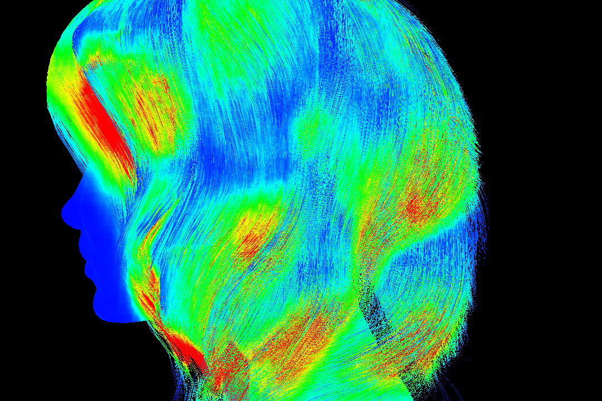
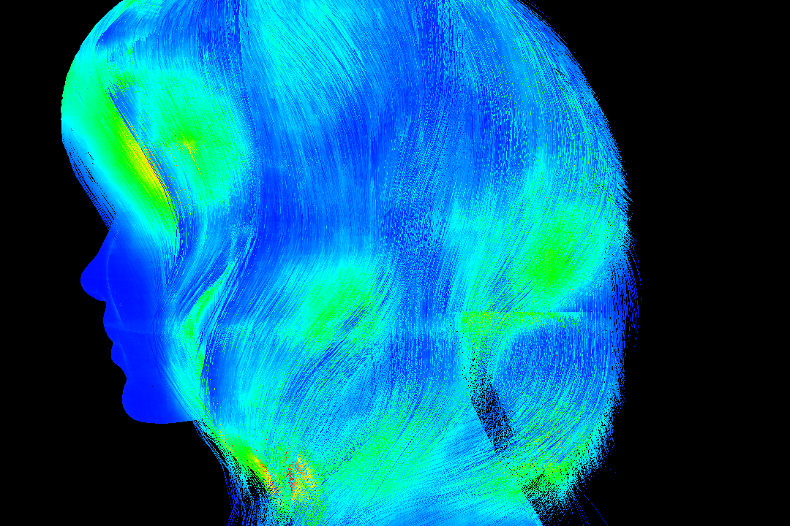

## Bounding Volume Hierarchies for Oblong Objects
Master Thesis at the Czech Technical University in Prague (https://dspace.cvut.cz/handle/10467/96751?locale-attribute=en)

### Abstract
This thesis discusses using cylinders as bounding volumes in ray tracing for specific scene types containing oblong objects. 
It offers a method for joining cylinder-shaped bounding volumes and shows their advantages. The presented method incorporates 
cylinders into a state-of-the-art bottom-up hierarchy builder, a locally-ordered clustering algorithm. The provided implementation 
is a proof of concept. Three types of bounding volume hierarchies were compared, the common axis-aligned bounding box (AABB) 
hierarchy, a cylinder version, and a hybrid. The obtained results show that cylinder volumes have the potential to reduce the 
overall surface area of the hierarchy for oblong objects. Moreover, the hybrid hierarchy outperforms the AABB version in rendering 
certain scenes while increasing the build times.

This is a modified implementation of a BVH builder library by Arsène Pérard-Gayot. 
The original can be found at: https://github.com/madmann91/bvh
License file (LICENSE.txt) and original readme (original_README.md) included.

### How to run
The exe is located in the bin folder. Usage:

benchmark.exe \[options\] file.obj

### Sample results
Heatmap of ray-tracing performance using AABBs (left) and using the proposed hybrid hierarchy with cylinders.

    
    

